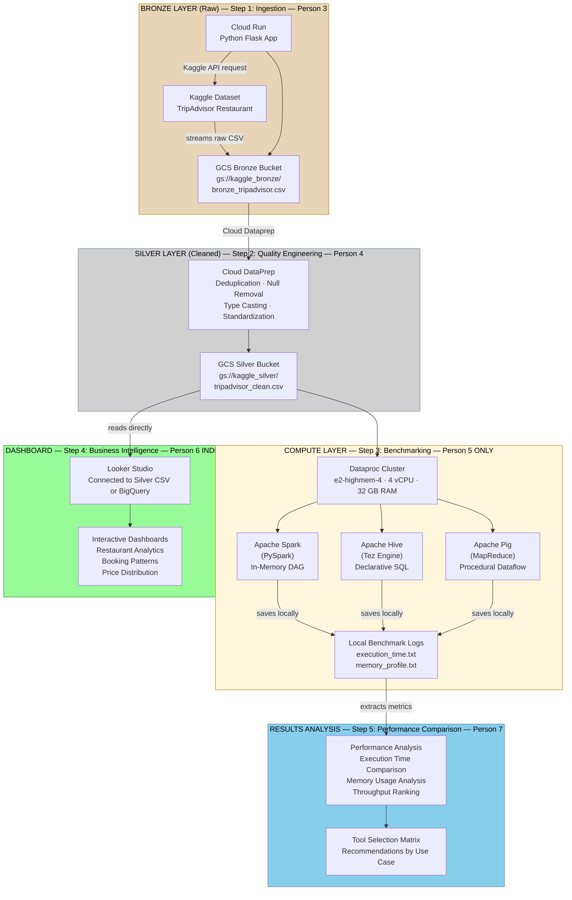

# Big Data Pipeline: Performance Comparison with Apache Tools

---

## Project Overview & Domain
- **Domain:** Tourism and hospitality
- **Dataset:** TripAdvisor Restaurant Recommendation Data (from Kaggle)
- **Project Approach:** Build a complete big data solution with multiple problem statements + performance comparison of Apache technologies (Spark, Hive, Pig)

---

## Defined Problem Statements

### Problem Statement 1: Data Ingestion & Quality (Bronze → Silver Layers)

---


### Problem Statement 2: Business Intelligence & Analytics (Silver → Dashboard)

---

### Problem Statement 3: Compute Engine Performance Benchmarking (Apache Tools Comparison)


---

## Tech Stack & GCP Infrastructure Map (Medallion Architecture)

### Storage Layers
| Layer | Purpose | Storage | Managed By |
|-------|---------|---------|-----------|
| **Bronze** | Raw ingestion | GCS Bucket | Person 3 (Ingestion) |
| **Silver** | Cleaned, deduplicated | GCS Bucket | Person 4 (Data Cleaning) |
| **Gold** | Curated metrics | Dashboard/BigQuery | Person 6 (Dashboard) |

### GCP Services
- **Ingestion:** Google Cloud Run (Python Flask + KaggleHub + Secret Manager)
- **Storage Landing Zones:** Google Cloud Storage (GCS) Buckets (`kaggle_bronze_bucket`, `kaggle_silver_bucket`)
- **Data Quality Automation:** Cloud Dataprep by Trifacta (Alteryx)
- **Distributed Processing:** GCP Dataproc Cluster (Managed Apache Spark/Hive/Pig)
  - Machine Type: e2-highmem-4 (4 vCPU, 32 GB RAM)
  - Image Version: 2.3.30-ubuntu22
  - Optional Components: Jupyter, Zookeeper, Iceberg, Pig
- **Compute Engines Benchmarked:** 
  - Apache Spark (PySpark) — In-memory DAG
  - Apache Hive (Tez Engine) — SQL-on-Hadoop
  - Apache Pig (MapReduce) — Procedural Dataflow
- **Business Intelligence:** Looker Studio (connected to GCS Silver CSV or BigQuery)
- **Secrets Management:** Google Cloud Secret Manager (Kaggle API credentials)

---

## Project Architecture & Data Flow



**Key Changes from Previous Architecture:**
- ✅ Person 5 benchmarks ONLY (no BigQuery/Gold writes)
- ✅ Person 6 reads Silver directly (independent from Person 5)
- ✅ Person 7 analyzes benchmark metrics separately
- ✅ Person 6 and Person 5 work in PARALLEL (no dependency)

---

## VS Code Project Structure

```text
BigDataManagement_Project/
├── src/
│   ├── ingestion/
│   │   ├── ingestion_cloudrun.py     # Cloud Run Flask app (Kaggle → Bronze)
│   │   └── requirements.txt          # Python dependencies
│   │
│   ├── compute/
│   │   ├── dataproc_spark.py         # PySpark benchmark (local logs only)
│   │   ├── dataproc_hive.hql         # HiveQL benchmark script
│   │   ├── dataproc_pig.pig          # Pig Latin benchmark script
│   │
│   └── images/
│       ├── CloudShell_openeditor_button.png
│       ├── Example_spark_output.png
│       ├── Example_hive_output.png
│       └── Example_pig_output.png
│
├── TEAM_ALLOCATION.md                 # 8-person team roles & dependencies
├── README.md                          # This file
└── .gitignore
```

---

## 8-Person Team Allocation & Roles

### Team Member Roles & Deliverables

| # | Person | Role | Technical Work | Report Section | Dependency | Status |
|---|--------|------|----------------|----------------|-----------|--------|
| **1** | Person 1 | Intro & Problems | ❌ None | Abstract, Keywords, Introduction, Problem Statements | Independent ✅ | ~1.5-2 pages |
| **2** | Person 2 | Architecture | ❌ None | Architecture Diagram, Framework Explanation | Independent ✅ | ~0.5 pages |
| **3** | Person 3 (RIDHWAN - Admin) | IAM + Ingestion | ✅ Cloud Run + Secret Manager | IAM Setup, Ingestion Pipeline, Bronze Output | Independent ✅ | ~2-2.5 pages |
| **4** | Person 4 | Data Cleaning | ✅ Cloud Dataprep | Data Quality, Deduplication, Null Handling | Depends on P3 ⏳ | ~1.5 pages |
| **5** | Person 5 | Apache Tools Benchmark | ✅✅ Spark/Hive/Pig | Tool Implementation, Raw Metrics, Code | Depends on P4 ⏳ | ~1.5-2 pages |
| **6** | Person 6 | Dashboard & BI | ✅ Looker Studio | Business Insights, Dashboard Screenshots | Depends on P4 ONLY ✅ | ~1.5-2 pages |
| **7** | Person 7 | Results Analysis | ✅ Analysis & Charts | Benchmark Comparison, Performance Analysis, Tool Matrix | Depends on P5 ⏳ | ~2 pages |
| **8** | Person 8 | Conclusion | ❌ None | Executive Summary, Key Findings, Recommendations | All complete ⏳ | ~1 page |

**Total Report:** 10 pages (excluding front matter & references)

### Dependency Flow Chart
```
Person 1 (Independent)
Person 2 (Independent)
Person 3 (Independent) → Bronze CSV
    ↓
    Person 4 (Data Cleaning) → Silver CSV
         ├─ Person 5 (Benchmarking) → Metrics/Logs (LOCAL ONLY)
         │    └─ Person 7 (Analysis) → Performance Comparison
         │
         └─ Person 6 (Dashboard) → Looker Studio (INDEPENDENT FROM P5 ✅)
         
Person 8 (Conclusion - waits for all)
```

**Key Advantage:** Person 5 & Person 6 are PARALLEL
- If Person 5 is delayed, Person 6 is NOT affected ✅
- Person 6 reads Silver bucket directly
- Person 6 can optionally load to BigQuery independently

---

## GCP Infrastructure Setup

### Step 1: Enable Required APIs
```bash
gcloud services enable storage.googleapis.com \
  secretmanager.googleapis.com \
  cloudfunctions.googleapis.com \
  cloudbuild.googleapis.com \
  run.googleapis.com \
  dataproc.googleapis.com \
  logging.googleapis.com
```

### Step 2: Set Environment Variables
```bash
export PROJECT_ID="bigdatamanagement-497302"
export REGION="asia-southeast1"
export BRONZE_BUCKET="kaggle_bronze_bucket"
export SILVER_BUCKET="kaggle_silver_bucket"
export SA_NAME="bigdata-pipeline"
export SERVICE_ACCOUNT_EMAIL="${SA_NAME}@developer.gserviceaccount.com"
```

### Step 3: Create Service Account & Assign IAM Roles (Person 3's responsibility)
```bash
# Create service account
gcloud iam service-accounts create ${SA_NAME} \
  --display-name="Big Data Pipeline Service Account"

# Assign roles
for ROLE in storage.admin secretmanager.secretAccessor dataproc.editor metastore.editor bigquery.admin; do \
  gcloud projects add-iam-policy-binding ${PROJECT_ID} \
    --member="serviceAccount:${SERVICE_ACCOUNT_EMAIL}" \
    --role="roles/${ROLE}"; \
done
```

---

## Execution & Deployment Guide

### Phase 1: Data Ingestion (Bronze Layer) — Person 3

**Responsibility:** Set up IAM, deploy Cloud Run, validate ingestion

#### Secret Manager Setup
Store Kaggle API credentials at: `projects/{PROJECT_ID}/secrets/kaggle-json/versions/latest`

#### Cloud Run Deployment
```bash
gcloud functions deploy ingestion_kaggle \
  --runtime python310 \
  --trigger-http \
  --allow-unauthenticated \
  --region ${REGION} \
  --set-env-vars PROJECT_ID=${PROJECT_ID},BRONZE_BUCKET=${BRONZE_BUCKET}
```

#### Test Ingestion
```bash
curl -X POST "https://${REGION}-${PROJECT_ID}.cloudfunctions.net/ingestion_kaggle" \
  -H "Content-Type: application/json"
```

**Output:** `gs://kaggle_bronze_bucket/bronze_tripadvisor.csv`

---

### Phase 2: Data Cleaning (Silver Layer) — Person 4

**Responsibility:** Use Cloud Dataprep to clean data

#### Cloud Dataprep Workflow
1. Create new flow in Cloud Dataprep
2. Load Bronze CSV from GCS: `gs://kaggle_bronze_bucket/bronze_tripadvisor.csv`
3. Apply recipes:
   - **Recipe 1:** Remove duplicates
   - **Recipe 2:** Remove/fill NULL values
   - **Recipe 3:** Type casting (rating→FLOAT, review_count→INT)
   - **Recipe 4:** Standardize column names (lowercase, underscores)
4. Output to Silver: `gs://kaggle_silver_bucket/tripadvisor_clean.csv`

#### Validation
- Record before/after metrics:
  - Total rows: X → Y (Z% reduction)
  - Duplicate rows: A → 0
  - Null percentage: B% → C%

**Output:** `gs://kaggle_silver_bucket/tripadvisor_clean.csv`

---

### Phase 3: Distributed Compute Benchmarking (Compute Layer) — Person 5

**CRITICAL CHANGE:** Person 5 benchmarks ONLY - NO BigQuery or GCS Gold writes
- Record execution metrics locally
- Save benchmark logs
- Person 7 analyzes results separately

#### Create Dataproc Cluster (via GCP UI)
1. **Basic Setup**
   - Cluster Name: kaggle-cluster
   - Region: asia-southeast1
   - Cluster type: Single Node (1 master, 0 workers)

2. **Versioning & Components**
   - Image version: 2.3.30-ubuntu22
   - Optional components: Jupyter, Zookeeper, Iceberg, Pig

3. **Hardware Configuration**
   - Master node machine type: e2-highmem-4
   - Primary disk size: 100 GB

4. **Cluster Properties (YARN/Spark Fixes)**
   - `yarn.scheduler.capacity.maximum-am-resource-percent: 0.8`
   - `spark.dynamicAllocation.enabled: true`
   - `spark.dynamicAllocation.executorIdleTimeout: 60s`
   - `spark.dynamicAllocation.cachedExecutorIdleTimeout: 60s`

#### Benchmark Query (Identical for All Three Tools)
```sql
SELECT location, type, price_range, COUNT(name) as total_restaurants
FROM tripadvisor_clean_table
WHERE location IS NOT NULL AND location != 'location'
GROUP BY location, type, price_range
ORDER BY total_restaurants DESC
LIMIT 5;
```

#### Apache Spark (PySpark) — Person 5

```python
# src/compute/dataproc_spark.py
import time
from pyspark.sql import SparkSession
from pyspark.sql.functions import col, count

spark = SparkSession.builder \
    .appName("Tripadvisor-Benchmark-Spark") \
    .config("spark.sql.warehouse.dir", "file:///tmp/spark-warehouse") \
    .enableHiveSupport() \
    .getOrCreate()

start_spark = time.time()

# Load Silver data
df = spark.read.csv("gs://kaggle_silver_bucket/tripadvisor_clean.csv", 
                    header=True, inferSchema=True)

# Execute benchmark query
result = df.filter(col("location").isNotNull()) \
           .groupBy("location", "type", "price_range") \
           .agg(count("name").alias("total_restaurants")) \
           .sort(col("total_restaurants").desc()) \
           .limit(5)

result.show()

# ONLY save locally for logging (no BigQuery/Gold writes)
result.coalesce(1).write.mode("overwrite").csv("/tmp/spark_output")

end_spark = time.time()
spark_time = end_spark - start_spark

print("=" * 60)
print(f"SPARK EXECUTION TIME: {spark_time:.2f} seconds")
print("=" * 60)

spark.stop()
```

**Execution & Timing:**
```bash
start_time=$(date +%s)
spark-submit src/compute/dataproc_spark.py > /tmp/spark_run1.log 2>&1
end_time=$(date +%s)
echo "Spark Runtime: $((end_time - start_time)) seconds" >> /tmp/spark_run1.log
```

#### Apache Hive (HiveQL) — Person 5

```sql
-- src/compute/dataproc_hive.hql
CREATE EXTERNAL TABLE tripadvisor_clean_table (
    name STRING,
    location STRING,
    type STRING,
    price_range STRING,
    rating FLOAT,
    review_count INT
)
ROW FORMAT DELIMITED
FIELDS TERMINATED BY ','
LOCATION 'gs://kaggle_silver_bucket/tripadvisor_clean/';

SELECT location, type, price_range, COUNT(name) as total_restaurants
FROM tripadvisor_clean_table
WHERE location IS NOT NULL AND location != 'location'
GROUP BY location, type, price_range
ORDER BY total_restaurants DESC
LIMIT 5;
```

**Execution & Timing:**
```bash
start_time=$(date +%s)
hive -f src/compute/dataproc_hive.hql > /tmp/hive_run1.log 2>&1
end_time=$(date +%s)
echo "PURE STANDALONE APACHE HIVE RUNTIME: $((end_time - start_time)) SECONDS" >> /tmp/hive_run1.log
```

#### Apache Pig (Pig Latin) — Person 5

```pig
-- src/compute/dataproc_pig.pig
tripadvisor = LOAD 'gs://kaggle_silver_bucket/tripadvisor_clean.csv' 
              USING PigStorage(',') AS 
              (name, location, type, price_range, rating, review_count);

filtered = FILTER tripadvisor BY location IS NOT NULL AND location != 'location';

grouped = GROUP filtered BY (location, type, price_range);

counted = FOREACH grouped GENERATE 
          group.location as location,
          group.type as type,
          group.price_range as price_range,
          COUNT(filtered) as total_restaurants;

sorted = ORDER counted BY total_restaurants DESC;

limited = LIMIT sorted 5;

STORE limited INTO '/tmp/pig_output';
```

**Execution & Timing:**
```bash
start_time=$(date +%s)
pig -useHCatalog src/compute/dataproc_pig.pig > /tmp/pig_run1.log 2>&1
end_time=$(date +%s)
echo "PURE STANDALONE APACHE PIG RUNTIME: $((end_time - start_time)) SECONDS" >> /tmp/pig_run1.log
```

**Important:** All three tools' results saved as LOCAL LOGS ONLY (in `/tmp/`)

---

### Phase 4: Business Intelligence Dashboard — Person 6 (INDEPENDENT)

**Responsibility:** Build dashboard from Silver layer data (does NOT depend on Person 5)

#### Option A: Connect Looker Studio Directly to GCS (Recommended - Fastest)
1. Create Looker Studio data source → GCS CSV
2. Point to: `gs://kaggle_silver_bucket/tripadvisor_clean.csv`
3. Build visualizations directly

#### Option B: Load Silver to BigQuery First (More Scalable)
```bash
bq load --autodetect --source_format=CSV \
  restaurant_gold_db.restaurants \
  'gs://kaggle_silver_bucket/tripadvisor_clean.csv'
```

#### Dashboard 1: Restaurant Analytics
- Top 10 restaurants by location & price range
- Rating distribution (histogram)
- Review count distribution
- Geographic heatmap

#### Dashboard 2: Booking Patterns
- Daily booking volume by location
- Price range distribution (pie chart)
- Cuisine type popularity
- Most popular restaurants (top 20)

**Business Questions Answered:**
- How many people book daily by location?
- What's the most famous restaurant (top ratings + reviews)?
- What price ranges are preferred?
- Which locations have highest concentration of highly-rated restaurants?

---

### Phase 5: Performance Analysis & Results — Person 7

**Responsibility:** Extract metrics from Person 5's logs and create comparison analysis

#### Compile Benchmark Data
Extract from Person 5's local logs:
- Spark Run 1: X.XX sec, Run 2: X.YY sec, Run 3: X.ZZ sec
- Hive Run 1: A.AA sec, Run 2: A.BB sec, Run 3: A.CC sec
- Pig Run 1: P.PP sec, Run 2: P.QQ sec, Run 3: P.RR sec

#### Calculate Metrics
```
Average execution time per tool
Standard deviation
Throughput (rows per second)
Memory usage (if captured)
```

#### Performance Comparison Results

| Tool | Avg Execution Time | Memory Profile | Throughput | Best For |
|------|-------------------|----------------|-----------|----------|
| **Spark** | X.XX sec | Y MB | Z rows/sec | Real-time analytics, iterative ML |
| **Hive** | A.AA sec | B MB | C rows/sec | Data warehouse, complex joins |
| **Pig** | P.PP sec | Q MB | R rows/sec | Complex ETL pipelines |

#### Tool Selection Matrix
| Criteria | Spark | Hive | Pig |
|----------|-------|------|-----|
| Speed | ⭐⭐⭐⭐⭐ | ⭐⭐⭐⭐ | ⭐⭐⭐ |
| SQL Familiarity | ⭐⭐⭐ | ⭐⭐⭐⭐⭐ | ⭐⭐ |
| Memory Efficiency | ⭐⭐⭐ | ⭐⭐⭐⭐ | ⭐⭐⭐⭐⭐ |
| Ease of Learning | ⭐⭐⭐⭐ | ⭐⭐⭐⭐⭐ | ⭐⭐⭐ |

#### Key Findings (Expected)
- **Spark Advantage:** DAG optimization, in-memory processing → fastest
- **Hive Trade-off:** Metastore overhead but SQL-friendly for teams
- **Pig Characteristic:** MapReduce model with disk I/O → slowest but flexible for complex ETL

---

## Report Structure (10 Pages Total)

| Page # | Content | Author |
|--------|---------|--------|
| 1 | Abstract + Keywords | Person 1 |
| 2 | Introduction | Person 1 |
| 2.5 | Problem Statements | Person 1 |
| 3 | Architecture & Framework | Person 2 |
| 4-5 | IAM & Ingestion (Bronze) | Person 3 |
| 5.5-6 | Data Cleaning (Silver) | Person 4 |
| 6.5-7 | Apache Tools Implementation & Code | Person 5 |
| 7.5-8 | Raw Benchmark Results | Person 5 |
| 8.5-9 | Dashboard & Business Insights | Person 6 |
| 9-10 | Performance Comparison & Tool Analysis | Person 7 |
| 10+ | Conclusion & Recommendations | Person 8 |

---

## Presentation Slide Allocation (10 Slides Max)

| # | Slide | Speaker | Duration |
|---|-------|---------|----------|
| 1 | Title Slide | Person 1 | 15 sec |
| 2 | Problem Statements | Person 1 | 30 sec |
| 3 | Architecture Diagram | Person 2 | 45 sec |
| 4 | IAM & Ingestion Flow | Person 3 | 1 min |
| 5 | Data Cleaning Results | Person 4 | 1 min |
| 6 | Apache Tools Code | Person 5 | 1.5 min |
| 7 | Dashboard Screenshots | Person 6 | 1 min |
| 8 | Benchmark Results Chart | Person 7 | 1 min |
| 9 | Tool Selection Matrix | Person 7 | 1 min |
| 10 | Conclusion & Recommendations | Person 8 | 1 min |
| | **TOTAL** | | **~10 min** |

---

## Key Differences from Original README

### ✅ UPDATED:

1. **Gold Layer Handling**
   - ❌ OLD: "Spark/Hive/Pig write to BigQuery/Gold"
   - ✅ NEW: "Person 5 benchmarks locally only, no writes"

2. **Dashboard Independence**
   - ❌ OLD: "Dashboard depends on Apache tools results"
   - ✅ NEW: "Person 6 reads Silver directly, independent from Person 5"

3. **Team Roles**
   - ❌ OLD: Generic roles (Group Leader, Data Ingestion Engineers, etc.)
   - ✅ NEW: 8 specific people with clear deliverables

4. **Architecture Diagram**
   - ❌ OLD: Shows results flowing to Gold/BigQuery
   - ✅ NEW: Shows benchmarks saved locally, dashboard independent path

5. **Phase 3 & 4 Descriptions**
   - ❌ OLD: Vague about who does what
   - ✅ NEW: Crystal clear: Person 5 benchmarks, Person 6 dashboard, Person 7 analysis

6. **Dependency Flow**
   - ❌ OLD: Linear 1→2→3→4
   - ✅ NEW: Parallel paths (P5 & P6 independent at step 4)

---

## Running the Project End-to-End

### Timeline
1. we only have 2 weeks...

### No Blocking!
- If Person 5 delays → Only Person 7 waits, NOT Person 6 ✅
- Each person knows exactly when to start and what they need


**For detailed team member responsibilities, see:** [TEAM_ALLOCATION.md](TEAM_ALLOCATION.md)
