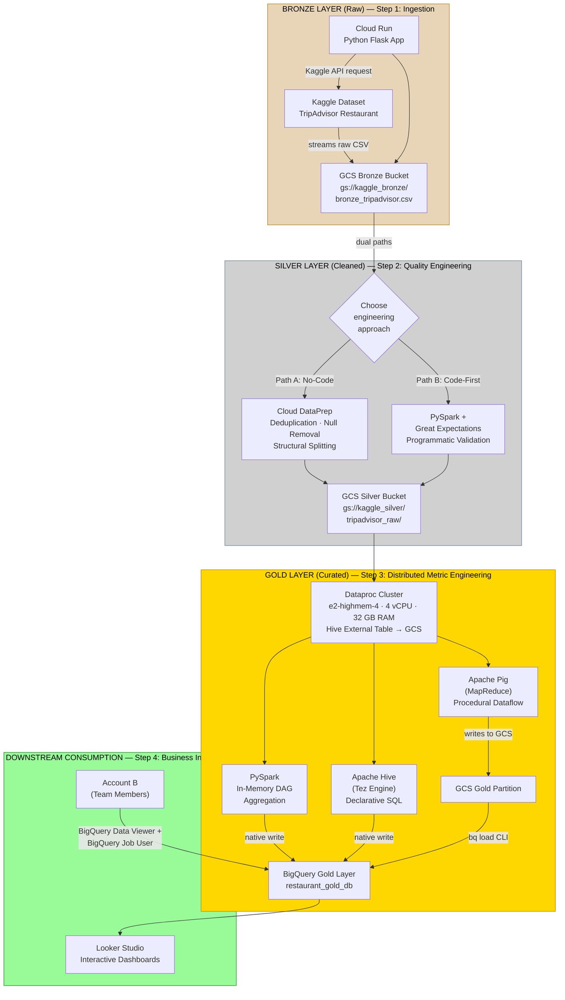

# Big Data Pipeline: Performance comparison with Apache tools

# We need to ensure its as convenient and easy as possible for the team members for this project.

In this template we are tackling the comparison of apache tools

## To do list

Pick dataset

Booking or tripadvisor (whichever that is easier for our analysis and comparison)

criteria for dataset would be at least have:
1. Have qualitative columns (City, State, Price_range)
2. Have quantitative columns (Rating, Review_count)
3. At least more than 500 rows
4. 1 CSV please, easier to process

## Give access to tools via IAM roles

## Split task between 8 team members

1. GCP setup until ingestion (Ridhwan)
2. Data quality
3. Apache tools comparison (Hive, Pig, Spark), Best tool write to bigquery
4. Metrics
5. BI Dashboard

## Report (max 10 pages)

## Powerpoint (Docs, max 10 pages)

## Video (max 10 mins)


---

## Project Overview & Domain
- **Domain:** Tourism and hospitality
- **Dataset:** To be filled




---

## Defined Problem Statements

### 1. Ingestion & Data Quality Governance

### 2. Business Value Extraction


### 3. Compute Engine Optimization Benchmarking


---

ITES NOT SERVERLESS

## Tech Stack & GCP Infrastructure Map


- **Ingestion:** Google Cloud Run (Python Flask + KaggleHub + Secret Manager)
- **Storage Landing Zone:** Google Cloud Storage (GCS) Buckets (`kaggle_bronze_bucket`, `kaggle_silver_bucket`, `kaggle_gold_bucket`)
- **Data Quality Automation:** Cloud Dataprep by Trifacta (Alteryx)
- **Distributed Processing:** GCP Dataproc Cluster (Managed Apache Spark) (e2-highmem-4, 4 vCPU, 32 GB RAM) — Hive external tables read directly from GCS
- **Compute Engines Benchmarked:** Apache Spark (PySpark) · Apache Hive (Tez) · Apache Pig (MapReduce)
- **Enterprise Warehouse:** Google BigQuery
- **Business Intelligence Dashboard:** Looker Studio (Data Studio)
- **Secrets Management:** Google Cloud Secret Manager (Kaggle API credentials)

---

## VS Code Project Structure

```text
├── src/
│   ├── ingestion/
│   │   ├── ingestion_cloudrun.py # Cloud Run Flask app (Kaggle download → GCS Bronze)
│   │   └── requirements.txt      # Python dependencies
│   │   
│   ├── dataprep/
│   │   └── recipe.json           # Exported Dataprep data quality cleaning logic
│   └── compute/
│       ├── dataproc_spark.py     # PySpark DataFrame job (in-memory DAG)
│       ├── dataproc_hive.hql     # HiveQL script (Tez execution engine)
│       └── dataproc_pig.pig      # Pig Latin script (MapReduce execution engine)
├── scripts/
│   └── deploy.sh                 # GCloud CLI deployment scripts
└── README.md                     # Technical documentation
```

---


## GCP Infrastructure Setup

### Enable Required APIs
```bash
gcloud services enable storage.googleapis.com \
  secretmanager.googleapis.com \
  cloudfunctions.googleapis.com \
  cloudbuild.googleapis.com \
  run.googleapis.com \
  logging.googleapis.com
```

### Assign IAM Roles to Compute Service Account
```bash
export SA_NAME="921953242742-compute"
export SERVICE_ACCOUNT_EMAIL="${SA_NAME}@developer.gserviceaccount.com"

for ROLE in storage.admin secretmanager.secretAccessor dataproc.editor bigquery.admin; do
  gcloud projects add-iam-policy-binding ${PROJECT_ID} \
    --member="serviceAccount:${SERVICE_ACCOUNT_EMAIL}" \
    --role="roles/${ROLE}"
done
```

---

## Execution & Deployment Guide

### Phase 1: Ingestion — Kaggle → Cloud Run → Bronze GCS

Set environment variables:
```bash
export PROJECT_ID="bigdatamanagement-497302"
export BRONZE_BUCKET="kaggle_bronze_bucket"
```

Store Kaggle API credentials (`kaggle.json`) in Secret Manager at the path:
`projects/{PROJECT_ID}/secrets/kaggle-json/versions/latest`

The Cloud Run Python app (`src/ingestion/ingestion_cloudrun.py`):
1. Retrieves Kaggle credentials from Secret Manager
2. Downloads the TripAdvisor dataset via kagglehub
3. Standardizes column names (lowercase, spaces/hyphens → underscores)
4. Uploads the CSV to GCS Bronze layer (`gs://kaggle_bronze_bucket/bronze_tripadvisor.csv`)

### Phase 2: Data Quality Processing — Bronze → Silver

Open Cloud Dataprep (now Alteryx Trifacta) via the web console, load the raw file from the Bronze bucket, apply type-casting and cleaning recipes, and schedule the run to output the cleaned file into the **Silver layer** (`gs://kaggle_silver_bucket/tripadvisor_raw/`).

### Phase 3: Distributed Compute Benchmarking

Create a Dataproc cluster (via UI or CLI):
- Region: `asia-southeast1`
- Machine type: `e2-highmem-4` (4 vCPU, 32 GB RAM)
- Components: Jupyter, Pig, Hive

**Run Hive Benchmark:**
```bash
start_time=$(date +%s)
hive -f dataproc_hive.hql
end_time=$(date +%s)
echo "HIVE RUNTIME: $((end_time - start_time)) SECONDS"
```

**Run Pig Benchmark:**
```bash
start_time=$(date +%s)
pig -useHCatalog dataproc_pig.pig
end_time=$(date +%s)
echo "PIG RUNTIME: $((end_time - start_time)) SECONDS"
```

The Hive and Pig scripts execute an identical aggregation:
```sql
SELECT location, type, price_range, COUNT(name) as total_restaurants
FROM tripadvisor_clean_table
WHERE location IS NOT NULL AND location != 'location'
GROUP BY location, type, price_range
ORDER BY total_restaurants DESC
LIMIT 5;
```

### Phase 4: BigQuery & Looker Studio — Gold Layer

Load the cleaned Silver data into BigQuery tables, then connect Looker Studio to build interactive dashboards for restaurant analytics.

---

## Recorded Performance Benchmarks & Results
*(Populated during production testing phase)*

| Experiment Run Target | Spark (PySpark) | Hive (Tez) | Pig (MapReduce) |
|---|---|---|---|
| Test Query: Aggregation + Group By + Order By | X.XX seconds | Y.YY seconds | Z.ZZ seconds |

### Key Findings for Documentation
- **Spark Strategy Acceleration:** Spark's in-memory Directed Acyclic Graph (DAG) optimization bypassed structural metadata lookups, executing calculations significantly faster than the Hive and Pig models.
- **Hive Strategy Overhead:** Hive external tables reading directly from GCS via the embedded Derby metastore introduced serialization overhead from Tez container initialization and metadata lookups, resulting in higher execution times compared to Spark's in-memory processing.
- **Pig Strategy Characteristics:** Pig's dataflow scripting model compiled to MapReduce incurred additional serialization overhead between each processing step, making it the slowest of the three engines for this aggregation workload.

---

## Project Contribution Matrix
To simplify evaluation, roles are divided evenly among team members:

- **Group Leader:** Infrastructure coordination, Dataproc cluster setup, and documentation assembly.
- **Data Ingestion Engineers:** Managed Cloud Run API development, Kaggle integration via Secret Manager, and standardized the Bronze layer landing logic.
- **Data Quality Engineers:** Authored the data verification recipes in Dataprep for Bronze → Silver transformation.
- **Data Platform Engineers (Spark/Hive/Pig):** Programmed scripts using PySpark, HiveQL, and Pig Latin, managed the Dataproc cluster, and executed benchmarking metrics.
- **BI Visualizers:** Built out final BigQuery data tables and structured the interactive dashboards in Looker Studio.
