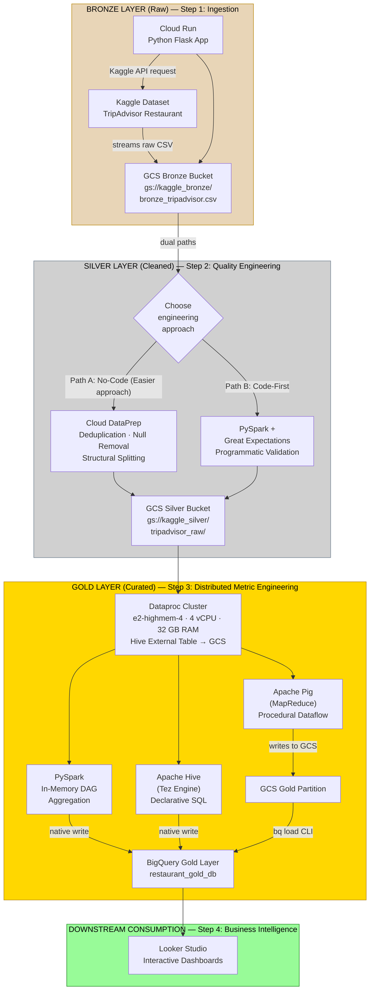
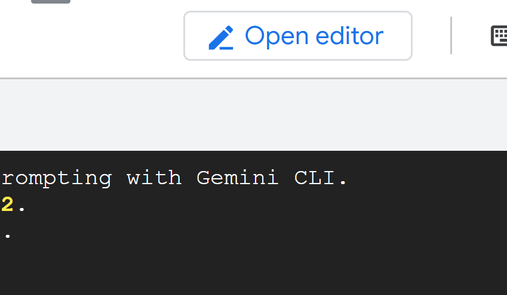
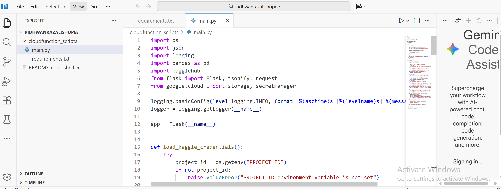
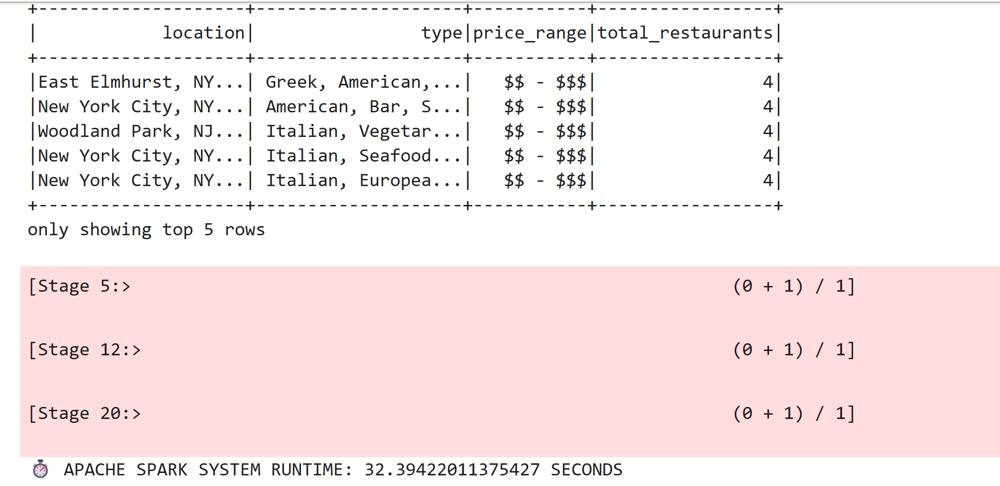
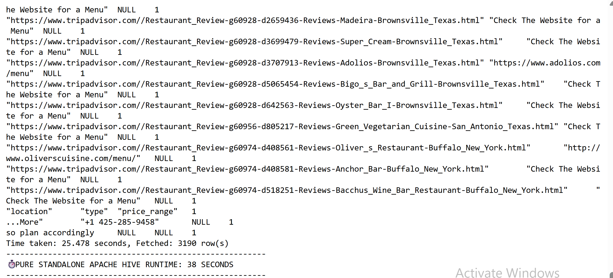
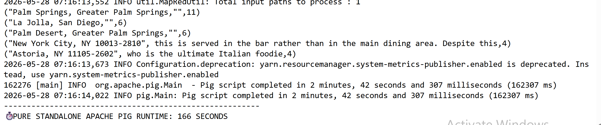

# Big Data Pipeline: Performance comparison with Apache tools

---

## Project Overview & Domain
- **Domain:** Tourism and hospitality
- **Dataset:** To be filled (In this example i use random tripadvisor dataset on kaggle)

- **Project option:** build a complete big data solution using different tools with a number of problem statements + comparison results of different Apache technologies

Example Problem Statements:
1. Data Ingestion and Quality (Bronze & Silver Layers) 
- How can we efficiently ingest raw Tripadvisor data from Kaggle and ensure data quality using parallel engineering paths (Cloud DataPrep and PySpark)?
2. Technology Performance Comparison (Gold Layer) 
- Which distributed processing tool—PySpark, Apache Hive, or Apache Pig—delivers the best computational performance when processing the dataset?
3. Business Intelligence and Insights (Downstream Consumption) 
- What key drivers of customer satisfaction can be discovered from the dataset and visualized through interactive Looker Studio dashboards?



---

## Defined Problem Statements

### 1. Ingestion & Data Quality/Cleaning

### 2. Business Value Extraction

### 3. Compute Engine Apache Tools Benchmarking

---

## Tech Stack & GCP Infrastructure Map (Medallion architecture)

- **Ingestion:** Google Cloud Run (Python Flask + KaggleHub + Secret Manager)
- **Storage Landing Zone:** Google Cloud Storage (GCS) Buckets (`kaggle_bronze_bucket`, `kaggle_silver_bucket`, `kaggle_gold_bucket`)
- **Data Quality Automation:** Cloud Dataprep by Trifacta (Alteryx)
- **Distributed Processing:** GCP Dataproc Cluster (Managed Apache Spark) (e2-highmem-4, 4 vCPU, 16 GB RAM) — Hive external tables read directly from GCS
- **Compute Engines Benchmarked:** Apache Spark (PySpark) · Apache Hive (Tez) · Apache Pig (MapReduce)
- **Enterprise Warehouse:** Google BigQuery
- **Business Intelligence Dashboard:** Looker Studio (Data Studio)
- **Secrets Management:** Google Cloud Secret Manager (Kaggle API credentials)

---

## VS Code Project Structure

```text
├── src/
│   ├── ingestion/
│   │   ├── ingestion_cloudrun.py # Cloud Run Flask app (Kaggle download → GCS Bronze)
│   │   └── requirements.txt      # Python dependencies
│   │   
│   └── compute/
│       ├── dataproc_spark.py     # PySpark DataFrame job (in-memory DAG)
│       ├── dataproc_hive.hql     # HiveQL script (Tez execution engine)
│       └── dataproc_pig.pig      # Pig Latin script (MapReduce execution engine)
├── scripts/
└── README.md                     # Technical documentation
```

---

## GCP Infrastructure Setup

### Enable Required APIs
```bash
gcloud services enable storage.googleapis.com \
  secretmanager.googleapis.com \
  cloudfunctions.googleapis.com \
  cloudbuild.googleapis.com \
  run.googleapis.com \
  logging.googleapis.com
```

### Add local env variables
```bash
export PROJECT_ID="bigdatamanagement-497302"
export REGION="asia-southeast1" # Set to Singapore
export BRONZE_BUCKET="kaggle_bronze_bucket"
export SILVER_BUCKET="kaggle_silver_bucket"
export SA_NAME="921953242742-compute"
export SERVICE_ACCOUNT_EMAIL="${SA_NAME}@developer.gserviceaccount.com"
```

### Assign IAM Roles to Compute Service Account
```bash
for ROLE in storage.admin secretmanager.secretAccessor dataproc.editor metastore.editor bigquery.admin; do \
  gcloud projects add-iam-policy-binding ${PROJECT_ID} \
    --member="serviceAccount:${SERVICE_ACCOUNT_EMAIL}" \
    --role="roles/${ROLE}"; \
done
```

---

## Execution & Deployment Guide

### Phase 1: Ingestion — Kaggle → Cloud Run → Bronze GCS

#### Secret Manager
Store Kaggle API credentials (`kaggle.json`) in Secret Manager at the path:
`projects/{PROJECT_ID}/secrets/kaggle-json/versions/latest`

1. Open CloudShell Editor mode by clicking "Open Editor"

<p align="center">
  
</p>

2. Add the ingestion python script and requirements.txt from (`src/ingestion/`) into the editor

<p align="center">
  
</p>

3. Run the bash command below in the terminal:

```bash
gcloud functions deploy ingestion_kaggle --runtime python310 --trigger-http --allow-unauthenticated --region ${REGION} --source ./cloudfunction_scripts --set-env-vars PROJECT_ID=${PROJECT_ID},BUCKET=${BUCKET} --timeout=540s --memory=1024MB
```
4. Test the function using the curl command provided in the Google Cloud UI:

```bash
curl -X POST "https://asia-southeast1-bigdatamanagement-497302.cloudfunctions.net/ingestion_kaggle" \
-H "Authorization: bearer $(gcloud auth print-identity-token)" \
-H "Content-Type: application/json" \
-d '{
  "name": "Developer"
}'
```

What the Cloud Run Python app does (`src/ingestion/ingestion_cloudrun.py`):
1. Retrieves Kaggle credentials from Secret Manager
2. Downloads the TripAdvisor dataset via kagglehub
3. Standardizes column names (lowercase, spaces/hyphens → underscores)
4. Uploads the CSV to GCS Bronze layer (`gs://kaggle_bronze_bucket/bronze_tripadvisor.csv`)

### Phase 2: Data Quality Processing — Bronze → Silver

Open Cloud Dataprep (now Alteryx Trifacta) via the web console, load the raw file from the Bronze bucket, apply type-casting and cleaning recipes, and schedule the run to output the cleaned file into the **Silver layer** (`gs://kaggle_silver_bucket/tripadvisor_raw/`).

### Phase 3: Distributed Compute Benchmarking

#### Example that we can do (not tested in the code)

- Daily Booking Patterns: "How many restaurants receive bookings daily?" (Group by restaurant, count distinct booking dates)
- Most Popular Hotels/Restaurants: "Top 10 restaurants by review count and average rating"
- Price Range Distribution: "What percentage of restaurants fall in each price range by location?"
- Geographic Hotspots: "Which locations have the highest concentration of highly-rated restaurants?"
- Rating vs. Popularity: "Correlation between review count and average rating"


#### Example benchmark
- Query-Level Comparisons:
- Execution Time: How long did each tool (PySpark, Hive, Pig) take to run the aggregation query?
- Memory Usage: Peak RAM consumed during processing


### Steps

Create a Dataproc cluster (via UI will be created by admin):
**1. Basic Setup**
Go to the Dataproc section in the Google Cloud Console.
- Click CREATE CLUSTER and select Cluster on Compute Engine
- Cluster Name: kaggle-cluster
- Region: asia-southeast1
- Zone: asia-southeast1-c
- Cluster type (Cheapest): Select Single Node (1 master, 0 workers)

**2. Versioning & Components**
Scroll down to Versioning.
- Image type: Select Ubuntu
- Image version: Select 2.3.30-ubuntu22
- Scroll down to Components -> Optional components
- Check the boxes for: Jupyter, Zookeeper, Iceberg, and Pig

**3. Hardware Configuration**
Expand the Nodes or Machine configuration section.
- Under Master node, click the Machine type dropdown
- Select e2-highmem-4 (Cheapest)
- (Optional) Adjust your primary disk size here if needed

**4. Custom Staging Bucket**
Expand the Customize cluster section.
- Locate the Cloud Storage staging bucket field
- Click Browse and select your dedicated bucket: `dataproc_staging_kaggle`

**5. Cluster Properties (The YARN/Spark Fixes)**
Still in the Customize cluster section, locate the Cluster properties block. You will click ADD PROPERTY four times to input your memory and timeout fixes.

When adding these, set the Prefix to Custom, or select the specific prefix (like yarn or spark) if the UI forces a dropdown:

Property 1 (Fixes the stuck AMs):
- Prefix: yarn (or yarn-site)
- Name: yarn.scheduler.capacity.maximum-am-resource-percent
- Value: 0.8

Property 2 (Enables resource sharing):
- Prefix: spark (or spark-defaults)
- Name: spark.dynamicAllocation.enabled
- Value: true

Property 3 (Kills idle kernels fast):
- Prefix: spark (or spark-defaults)
- Name: spark.dynamicAllocation.executorIdleTimeout
- Value: 60s

Property 4 (Clears cached memory fast):
- Prefix: spark (or spark-defaults)
- Name: spark.dynamicAllocation.cachedExecutorIdleTimeout
- Value: 60s

Once those are added, just hit the CREATE button at the bottom.

1. Start the cluster, click the "Web Interface" and open JupyterLab based on the photo provided below
2. Use the PySpark notebook to write and run PySpark code

<p align="center">
  
</p>

3. For Hive, run the code in the terminal:

Step 1: Create and open the file using a text editor. Since you are in a terminal, the easiest built-in text editor to use is nano:

```bash
nano tripadvisor_benchmark.hql
```

Step 2: Paste your script. Your terminal will change into a basic text editor screen. Paste your entire Hive script inside. Check the code available in `src/ingestion/ingestion_cloudrun.py` and `dataproc_hive_example.hql`.

Step 3: Save and Exit. To save the file in nano:
1. Press Ctrl + O (the letter O, to "Write Out" or save)
2. Press Enter to confirm the file name
3. Press Ctrl + X to exit the editor and return to the normal command line

Step 4: Execute the file with a timer. Now that the file is permanently saved on your master node's hard drive, you can run it as many times as you want without opening it again. To run it and get your final benchmark time, paste this execution block:

```bash
start_time=$(date +%s)
hive -f tripadvisor_hive.hql
end_time=$(date +%s)
echo "--------------------------------------------------------"
echo "PURE STANDALONE APACHE HIVE RUNTIME: $((end_time - start_time)) SECONDS"
echo "--------------------------------------------------------"
```

<p align="center">
  
</p>

4. For Pig, run the code in the terminal

Step 1: Create the Pig Script File
In that same black SSH terminal window, use nano to create your new Pig file. Check the code in `dataproc_pig.pig`.

Step 3: Save and Exit. Just like before:
1. Press Ctrl + O (to save)
2. Press Enter (to confirm)
3. Press Ctrl + X (to exit)

Step 4: Execute and Time the Run
Now, run the script using the native pig binary wrapper. Paste this block to get your final benchmark metric:

```bash
start_time=$(date +%s)
pig -useHCatalog tripadvisor_pig.pig
end_time=$(date +%s)
echo "--------------------------------------------------------"
echo "PURE STANDALONE APACHE PIG RUNTIME: $((end_time - start_time)) SECONDS"
echo "--------------------------------------------------------"
```

<p align="center">
  
</p>

The Spark, Hive and Pig scripts execute an identical aggregation:
```sql
SELECT location, type, price_range, COUNT(name) as total_restaurants
FROM tripadvisor_clean_table
WHERE location IS NOT NULL AND location != 'location'
GROUP BY location, type, price_range
ORDER BY total_restaurants DESC
LIMIT 5;
```

### Phase 4: BigQuery & Looker Studio — Gold Layer

Load the cleaned Silver data into BigQuery tables, then connect Looker Studio to build interactive dashboards for restaurant analytics.

---

## Recorded Performance Benchmarks & Results
*(Populated during production testing phase)*

| Experiment Run Target | Spark (PySpark) | Hive (Tez) | Pig (MapReduce) |
|---|---|---|---|
| Test Query: Aggregation + Group By + Order By | X.XX seconds | Y.YY seconds | Z.ZZ seconds |

### Key Findings for Documentation (Expected)
- **Spark Strategy Acceleration:** Spark's in-memory Directed Acyclic Graph (DAG) optimization bypassed structural metadata lookups, executing calculations significantly faster than the Hive and Pig models.
- **Hive Strategy Overhead:** Hive external tables reading directly from GCS via the embedded Derby metastore introduced serialization overhead from Tez container initialization and metadata lookups, resulting in higher execution times compared to Spark's in-memory processing.
- **Pig Strategy Characteristics:** Pig's dataflow scripting model compiled to MapReduce incurred additional serialization overhead between each processing step, making it the slowest of the three engines for this aggregation workload.

---

## Project Contribution Matrix
To simplify evaluation, roles are divided evenly among team members:

- **Group Leader:** Infrastructure coordination, Dataproc cluster setup, and documentation assembly.
- **Data Ingestion Engineers:** Managed Cloud Run API development, Kaggle integration via Secret Manager, and standardized the Bronze layer landing logic.
- **Data Quality Engineers:** Authored the data verification recipes in Dataprep for Bronze → Silver transformation.
- **Data Platform Engineers (Spark/Hive/Pig):** Programmed scripts using PySpark, HiveQL, and Pig Latin, managed the Dataproc cluster, and executed benchmarking metrics.
- **BI Visualizers:** Built out final BigQuery data tables and structured the interactive dashboards in Looker Studio.
