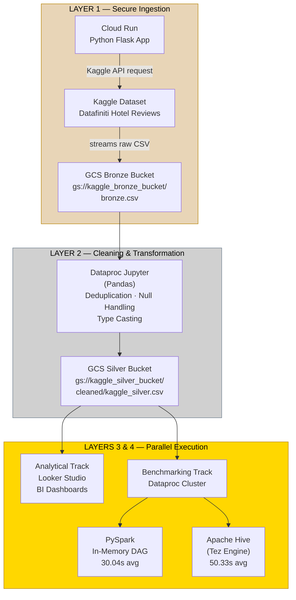
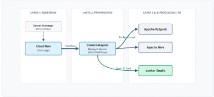
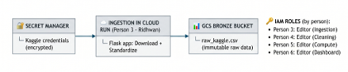
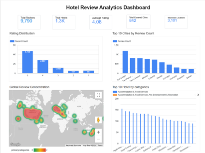
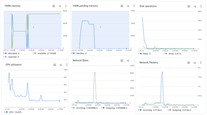
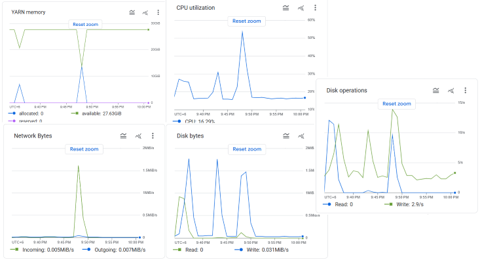
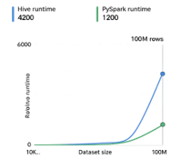

# Big Data Analytics Pipeline: Performance Benchmarking with Apache Spark and Apache Hive on Datafiniti Hotel Reviews

---

## Project Overview & Domain
- **Domain:** Tourism and hospitality — online hotel review analytics
- **Dataset:** [Datafiniti Hotel Reviews](https://www.kaggle.com/datasets/datafiniti/hotel-reviews) (Kaggle) — 10,000 records, 26 attributes
- **Project option:** Build a complete big data solution using Apache Spark and Apache Hive with performance benchmarking on Google Cloud Platform

This project uses big data analytics on the Datafiniti Hotel Reviews dataset by creating a workflow for data ingestion, data cleaning, business intelligence analysis, and performance benchmarking using Apache Spark and Apache Hive in a Hadoop-based environment on GCP Dataproc.



---

## Problem Statements

### Problem 1: Ingestion & Data Quality
Most hotel review databases come from online booking platforms, review websites, public web data, and third-party vendors. The input dataset may contain missing values, duplicate records, inconsistent rating formats, inadequate geographical details, irregular text structures, and noisy review comments. Data quality is important because unreliable data can affect the accuracy of business intelligence outputs. The raw Datafiniti Hotel Reviews dataset must be ingested into a suitable storage layer, schematized, validated, cleaned, and prepared as structured tables or DataFrames for Hive and Spark.

### Problem 2: Business Intelligence & Analytics
In hospitality and tourism, customer reviews help improve service, plan locations, track customer satisfaction, and evaluate hotel performance. Business knowledge can be gained by addressing analytical questions such as: Which hotels have the highest and lowest average ratings? How are customer ratings distributed? Do review trends suggest service quality issues? Which locations are the happiest? Structured queries in Hive and Spark's integrated batch/streaming/interactive structure are used to answer these questions.

### Problem 3: Compute Performance Benchmarking
Performance benchmarking between Apache Spark and Apache Hive addresses which technology is faster and better for hotel review analytics scenarios. Both can handle massive Hadoop datasets, but their strengths differ — in-memory distributed processing makes Spark faster and more iterative, while Hive is better for bulk data warehousing and SQL-style analytics. The benchmark evaluates execution time for tasks including counting records, grouping reviews by location, calculating average ratings, identifying top-rated hotels, filtering low-rated reviews, and ordering hotels by review count.

---

## Tech Stack & GCP Infrastructure Map

- **Ingestion:** Google Cloud Run (Python Flask + KaggleHub + Secret Manager)
- **Storage:** Google Cloud Storage (GCS) Buckets (`kaggle_bronze_bucket`, `kaggle_silver_bucket`, `kaggle_gold_bucket`)
- **Data Quality Engineering:** Dataproc Jupyter Notebook (Pandas)
- **Distributed Processing:** GCP Dataproc Cluster (e2-highmem-4, 4 vCPU, 16 GB RAM) — Hive external tables read directly from GCS
- **Compute Engines Benchmarked:** Apache Spark (PySpark) · Apache Hive (Tez)
- **Business Intelligence Dashboard:** Looker Studio (Data Studio)
- **Secrets Management:** Google Cloud Secret Manager (Kaggle API credentials)

---

## VS Code Project Structure

```text
├── src/
│   ├── ingestion/
│   │   ├── ingestion_cloudrun.py       # Cloud Run Flask app (Kaggle download → GCS Bronze)
│   │   └── requirements.txt            # Python dependencies
│   ├── compute/
│   │   ├── dataproc_spark_example.py   # PySpark DataFrame job (in-memory DAG)
│   │   ├── dataproc_hive_example.hql   # HiveQL script (Tez execution engine)
│   │   └── not_needed_dataproc_pig_example.pig  # Pig Latin script (not used in final benchmark)
│   └── images/                         # Screenshots and architecture images
├── scripts/
└── README.md                           # Technical documentation
```

---

## GCP Infrastructure Setup

### Login & Select Project

After logging into Google Cloud Console, ensure you are in the correct project:

1. Click the project dropdown at the top of the page

<p align="center">
  
</p>

2. Click **All** and select **bigdatamanagement**

<p align="center">
  
</p>

### Enable Required APIs
```bash
gcloud services enable storage.googleapis.com \
  secretmanager.googleapis.com \
  cloudfunctions.googleapis.com \
  cloudbuild.googleapis.com \
  run.googleapis.com \
  logging.googleapis.com
```

### Add local env variables
```bash
export PROJECT_ID="bigdatamanagement-497302"
export REGION="asia-southeast1"
export BRONZE_BUCKET="kaggle_bronze_bucket"
export SILVER_BUCKET="kaggle_silver_bucket"
export SA_NAME="921953242742-compute"
export SERVICE_ACCOUNT_EMAIL="${SA_NAME}@developer.gserviceaccount.com"
```

### Assign IAM Roles to Compute Service Account
```bash
for ROLE in storage.admin secretmanager.secretAccessor dataproc.editor metastore.editor bigquery.admin; do \
  gcloud projects add-iam-policy-binding ${PROJECT_ID} \
    --member="serviceAccount:${SERVICE_ACCOUNT_EMAIL}" \
    --role="roles/${ROLE}"; \
done
```

---

## Execution & Deployment Guide

### Phase 1: Ingestion — Kaggle → Cloud Run → Bronze GCS

#### Secret Manager
Store Kaggle API credentials (`kaggle.json`) in Secret Manager at the path:
`projects/{PROJECT_ID}/secrets/kaggle-json/versions/latest`

1. Open CloudShell Editor mode by clicking "Open Editor"

<p align="center">
  
</p>

2. Add the ingestion python script and requirements.txt from (`src/ingestion/`) into the editor

<p align="center">
  
</p>

3. Deploy the Cloud Function:
```bash
gcloud functions deploy ingestion_kaggle --runtime python310 --trigger-http --allow-unauthenticated --region ${REGION} --source ./cloudfunction_scripts --set-env-vars PROJECT_ID=${PROJECT_ID},BRONZE_BUCKET=${BRONZE_BUCKET} --timeout=540s --memory=1024MB
```

4. Test the function:
```bash
curl -X POST "https://asia-southeast1-bigdatamanagement-497302.cloudfunctions.net/ingestion_kaggle" \
-H "Authorization: bearer $(gcloud auth print-identity-token)" \
-H "Content-Type: application/json" \
-d '{"name": "Developer"}'
```

What the Cloud Run Python app does (`src/ingestion/ingestion_cloudrun.py`):
1. Retrieves Kaggle credentials from Secret Manager
2. Downloads the Datafiniti Hotel Reviews dataset via kagglehub
3. Standardizes column names (lowercase, spaces/hyphens → underscores)
4. Uploads the CSV to GCS Bronze layer (`gs://kaggle_bronze_bucket/bronze.csv`)

### Phase 2: Data Quality Engineering — Bronze → Silver

The raw dataset (10,000 records, 26 attributes) was processed using a **Dataproc Jupyter Notebook** environment with Pandas. The following operations were performed:

1. **Deduplication:** 210 duplicate records removed using `drop_duplicates()`
2. **Missing Value Handling:** `reviews_dateadded` column (10,000 nulls) dropped entirely; `reviews_userprovince` → "Unknown"; `reviews_title` → "No Title"
3. **Data Type Standardization:** Date columns (`dateadded`, `dateupdated`, `reviews_date`, `reviews_dateseen`) converted to datetime format

**Table 1: Dataset Quality Metrics Before and After Cleaning**

| Metric | Before Cleaning | After Cleaning |
|---|---|---|
| Total Records | 10,000 | 9,790 |
| Total Columns | 26 | 25 |
| Duplicate Records | 210 | 0 |
| Missing Values | 10,003 | 2,168 |

The cleaned dataset was exported to `gs://kaggle_silver_bucket/cleaned/kaggle_silver.csv`.

### Phase 3: Distributed Compute Benchmarking

#### Dataproc Cluster Setup

Create a Dataproc cluster via UI:
- **Name:** kaggle-cluster
- **Region:** asia-southeast1, Zone: asia-southeast1-c
- **Type:** Single Node (1 master, 0 workers)
- **Image:** 2.3.30-ubuntu22 with optional components: Jupyter, Zookeeper, Iceberg, Pig
- **Machine:** e2-highmem-4 (4 vCPU, 16 GB RAM)
- **Staging bucket:** `dataproc_staging_kaggle`
- **Cluster properties:** `yarn.scheduler.capacity.maximum-am-resource-percent=0.8`, `spark.dynamicAllocation.enabled=true`, `spark.dynamicAllocation.executorIdleTimeout=60s`, `spark.dynamicAllocation.cachedExecutorIdleTimeout=60s`

#### PySpark Execution

The PySpark pipeline loaded the cleaned dataset from GCS into a Spark DataFrame, grouped by `reviews_rating` to calculate total reviews and average rating using `groupBy()` and `agg()`. PySpark uses a DAG execution model with lazy evaluation.

<p align="center">
  
</p>

#### Hive Execution

HiveQL was implemented using an external table referencing the dataset in GCS. The query grouped data by `reviews_rating` and calculated total reviews and average rating using `COUNT()` and `AVG()`. Execution was done via Dataproc job submission.

<p align="center">
  
</p>

---

## Recorded Performance Benchmarks & Results

### Execution Time Summary

| Tool | Run 1 | Run 2 | Run 3 | Average |
|---|---|---|---|---|
| **PySpark** | 28.95 s | 32.03 s | 29.14 s | **30.04 s** |
| **Apache Hive (Tez)** | 55.00 s | 48.00 s | 48.00 s | **50.33 s** |

PySpark outperformed Hive with a **40.3% performance improvement**, averaging 30.04 seconds compared to 50.33 seconds for Hive. Both frameworks produced identical query results.

### Key Findings

- **Spark Strategy (In-Memory DAG):** Spark's in-memory Directed Acyclic Graph (DAG) optimization bypassed structural metadata lookups, executing calculations significantly faster than Hive. PySpark utilized CPU resources more intensively (~90% utilization) compared to Hive (~55%).

- **Hive Strategy (Tez Engine):** Hive external tables reading directly from GCS introduced serialization overhead from Tez container initialization and metadata lookups, resulting in higher execution times compared to Spark's in-memory processing.

### Scalability Projection

For the current relatively small dataset, Hive and PySpark exhibited comparable performance. However, PySpark is expected to scale more efficiently for large-scale analytical workloads due to its DAG-based execution model, in-memory processing, and advanced query optimization mechanisms (e.g., Adaptive Query Execution).

---

## Image Placeholder Reference

The following figures from the final report should be added to `src/images/`:

| Figure | Description | File Name |
|---|---|---|
| Figure 1 | System Architecture Diagram | `architecture_diagram.png` |
| Figure 2 | Data Ingestion Flow | `ingestion_flow.png` |
| Figure 3 | Looker Studio Dashboard Screenshot | `looker_dashboard.png` |
| Figure 4 | PySpark Resource Utilization & DAG Visualization | `pyspark_resource_dag.png` |
| Figure 5 | Hive Resource Utilization Monitoring | `hive_resource_utilization.png` |
| Figure 6 | Scalability Trend of Hive and PySpark | `scalability_trend.png` |

<p align="center">
  
</p>
<p align="center"><em>Figure 1: System Architecture Diagram — hybrid GCP + Apache ecosystem pipeline</em></p>

<p align="center">
  
</p>
<p align="center"><em>Figure 2: Data Ingestion Flow — credential retrieval, dataset download, cloud storage upload</em></p>

<p align="center">
  
</p>
<p align="center"><em>Figure 3: Business Intelligence Dashboard — KPIs, rating distribution, geographic heatmap, top hotels</em></p>

<p align="center">
  
</p>
<p align="center"><em>Figure 4: PySpark Resource Utilization Monitoring Dashboard & DAG Visualization</em></p>

<p align="center">
  
</p>
<p align="center"><em>Figure 5: Resource utilization metrics observed during Hive benchmark execution</em></p>

<p align="center">
  
</p>
<p align="center"><em>Figure 6: Scalability trend of Hive and PySpark as dataset size increases</em></p>

---

## Conclusion

### Project Recap
A cloud-based analytics pipeline was developed using GCP including Cloud Storage, Dataproc, Looker Studio, Apache Spark, and Apache Hive to analyze the Datafiniti Hotel Reviews dataset. The pipeline covered data ingestion, data cleaning, business intelligence analysis, and performance benchmarking.

### Key Findings
- Data quality improved significantly after cleaning (210 duplicates removed, missing values handled, date formats standardized)
- BI analysis revealed generally positive customer perception (avg rating 4.08/5.0) with 4,720 five-star reviews dominating sentiment
- Performance benchmarking showed PySpark (30.04s avg) outperforming Hive (50.33s avg) by 40.3% for identical aggregation workloads
- PySpark is recommended for large-scale analytics due to DAG-based optimization and in-memory processing; Hive remains suitable for SQL-based reporting and data warehouse applications

### Future Work
- Machine learning models for hotel performance and customer satisfaction prediction
- NLP and sentiment analysis on review text
- Real-time processing with Apache Kafka and Spark Streaming
- Multi-platform dataset expansion for more comprehensive analysis

---

## References

[1] Datafiniti, "Hotel Reviews," Kaggle, 2018. [Online]. Available: https://www.kaggle.com/datasets/datafiniti/hotel-reviews

[2] Datafiniti, "Datafiniti: Access data on property, people, and businesses," n.d. [Online]. Available: https://www.datafiniti.co/

[3] UN Tourism, "Digital Transformation," n.d. [Online]. Available: https://www.untourism.int/digital-transformation

[4] M. M. Mariani and R. Baggio, "Big data and analytics in hospitality and tourism: A systematic literature review," *International Journal of Contemporary Hospitality Management*, vol. 34, no. 1, pp. 231–278, 2022.

[5] T. Erl, W. Khattak, and P. Buhler, *Big Data Fundamentals: Concepts, Drivers & Techniques*. Boston, MA: Prentice Hall, 2016.

[6] Apache Software Foundation, "Apache Hive," n.d. [Online]. Available: https://hive.apache.org/

[7] Apache Software Foundation, "Apache Spark," n.d. [Online]. Available: https://spark.apache.org/

[8] M. Zaharia et al., "Apache Spark: A unified engine for big data processing," *Communications of the ACM*, vol. 59, no. 11, pp. 56–65, 2016.

[9] V. N. Kumar and P. Shindgikar, *Modern Big Data Processing with Hadoop*. Birmingham, UK: Packt Publishing, 2018.

[10] M. Zaharia, M. Chowdhury, M. J. Franklin, S. Shenker, and I. Stoica, "Spark: Cluster Computing with Working Sets," in *Proc. 2nd USENIX Conf. Hot Topics in Cloud Computing (HotCloud)*, Boston, MA, 2010.

[11] A. Thusoo et al., "Hive: A Warehousing Solution Over a Map-Reduce Framework," *Proc. VLDB Endowment*, vol. 2, no. 2, pp. 1629–1629, 2009.
